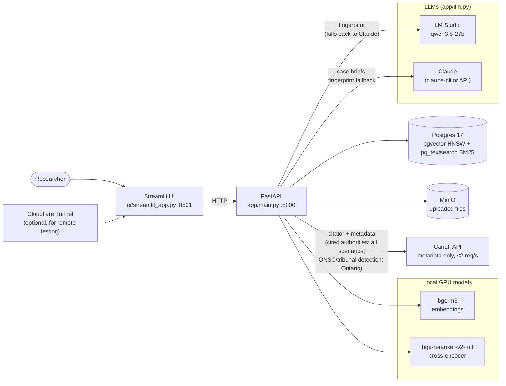
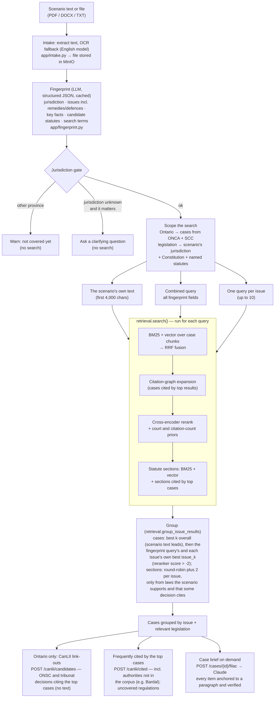
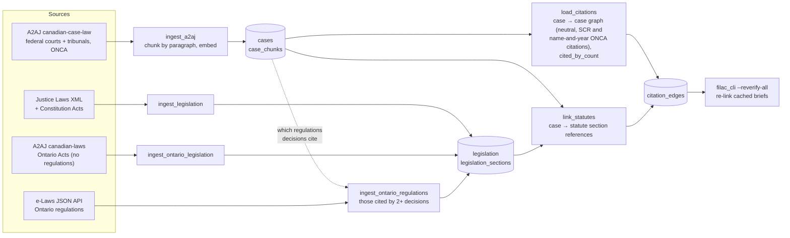

# LawSearch

Scenario → relevant Canadian authorities (Ontario + federal) → case briefs.
See [implementation-plan.md](implementation-plan.md) for the design and
[stack-and-setup.md](stack-and-setup.md) for stack decisions.

## Architecture

### Components



### Scenario search (`POST /scenarios`)



Typed queries (`POST /search`) skip intake, fingerprinting and the per-issue merge: one
`retrieval.search()` call over the whole corpus. A decision that isn't in the corpus (e.g. an
Ontario Superior Court ruling), or only a description of one, can be briefed on the Case brief
page (`POST /briefs`); it is never added to the searchable corpus.

### Data pipeline (offline)



`rebuild.ps1` runs the federal steps in order. ONCA
(`python -m scripts.ingest_a2aj ONCA`), Ontario Acts
(`python -m scripts.ingest_ontario_legislation`) and Ontario regulations
(`python -m scripts.ingest_ontario_regulations`) are separate commands. Re-run
`load_citations` and `link_statutes` after any of them.

Ontario regulations aren't in A2AJ, so `ingest_ontario_regulations` loads the ones the corpus
actually cites: it counts "O. Reg. N/YY" / "R.R.O. 1990, Reg. N" citations across all decisions,
keeps those cited by 2+ decisions (132; 97 still current on e-Laws, incl. O. Reg. 288/01 and the
Rules of Civil Procedure), and fetches each from e-Laws' JSON API one request a second. They're
matched in decision text by citation, and by title only when it's 3+ words ("Rules of Civil
Procedure"; many regulation titles are just "General"); the Rules are cited by rule ("r. 20.04").

## Prerequisites

- Docker Desktop (WSL2 backend; virtualization enabled in BIOS)
- Python 3.12 (python.org build, not the Microsoft Store one)
- NVIDIA GPU recommended for embeddings

## Setup

```powershell
copy .env.example .env
py -3.12 -m venv .venv
.venv\Scripts\python -m pip install -r requirements.txt

# sentence-transformers pulls CPU-only torch from PyPI; replace it with the CUDA build.
# Match the version pip installed (check with: pip show torch).
.venv\Scripts\python -m pip install --force-reinstall --no-deps torch==<version> --index-url https://download.pytorch.org/whl/cu130

docker compose up -d
.venv\Scripts\python -m scripts.migrate
.venv\Scripts\python -m scripts.smoke_test
```

The first smoke test run downloads `BAAI/bge-m3` (~4.3 GB) into `HF_HOME` from `.env`
(A2AJ dataset downloads land there too — point it at a drive with room).

## Run it

With the data loaded, one command starts the database, the API (waits for the models to
load) and the UI at http://localhost:8501. Ctrl+C stops the UI and API. The database keeps
running until `docker compose stop`. API output goes to `logs\api.log`.

```powershell
.\run.ps1          # database + API + UI
.\run.ps1 -NoUi    # database + API only
```

To build or refresh the data, `rebuild.ps1` runs the load steps below in order. It asks
before starting; `-Yes` skips the prompt. Every step is safe to re-run, and a failed step
prints the command to resume from it.

```powershell
.\rebuild.ps1                                    # migrate, cases (~5 h), citations, legislation, statute-links, briefs
.\rebuild.ps1 -From legislation                  # after pulling a newer Justice Laws consolidation
.\rebuild.ps1 -From citations -To citations      # a single step
```

If Windows blocks the scripts, run them as `powershell -ExecutionPolicy Bypass -File .\run.ps1`.

## Load the case corpus (Phase 1)

Federal courts and tribunals from A2AJ: ~117k decisions → 3.43M chunks, ~25 GB in
Postgres (including the 8.9 GB HNSW and 0.8 GB BM25 indexes). Needs ~3 GB more for
parquet downloads.

```powershell
# Preview chunk counts and storage without touching the GPU or DB
.venv\Scripts\python -m scripts.ingest_a2aj --federal --dry-run

# Load everything on one GPU (~5 h on an RTX 3090), then build the HNSW + BM25 indexes
.venv\Scripts\python -m scripts.ingest_a2aj --federal
```

Re-runs skip decisions already loaded, so an interrupted load resumes. With two GPUs,
split courts across processes and build the index once:

```powershell
$env:EMBEDDING_DEVICE="cuda:0"; .venv\Scripts\python -m scripts.ingest_a2aj SCC FC FPSLREB --no-index
$env:EMBEDDING_DEVICE="cuda:1"; .venv\Scripts\python -m scripts.ingest_a2aj RAD SST FCA --no-index
.venv\Scripts\python -m scripts.ingest_a2aj --build-index
```

Coverage notes: FC and FCA decisions start in 2001; ONSC is not in A2AJ at all.

## Search (Phase 2)

Hybrid retrieval: BM25 (pg_textsearch) and vector (HNSW) search over chunks, each
collapsed to case ranks and fused with Reciprocal Rank Fusion. Each case returns its
best passages with paragraph anchors. `--mode lexical|vector` runs one retriever alone.

```powershell
.venv\Scripts\python -m scripts.search_cli "side business losses treated as a hobby" -k 5
.venv\Scripts\python -m scripts.search_cli "right to counsel breath sample" --mode lexical --court SCC
```

API (`uvicorn app.main:app`, see below):

```http
POST /search
{"query": "reasonable expectation of profit hobby farm losses", "k": 10,
 "mode": "hybrid", "courts": ["TCC", "FCA"], "date_from": "2005-01-01"}
```

The Phase 2 baseline on the original 14 SCC-gold scenarios is in
`eval/runs/phase2-baseline.json` (hybrid recall@10 0.607). Phase 4 below supersedes it.

## Scenario eval (`/scenarios` pipeline)

`scripts/eval_retrieval.py` (below) scores one search over the raw scenario text.
`scripts/eval_scenarios.py` scores what `/scenarios` does: fingerprint, combined + per-issue
searches, then merge. It compares merge strategies on the same search results, and reports
per-issue coverage for scenarios whose gold authorities carry `issues` tags (`on-003`/`on-004`).

```powershell
.venv\Scripts\python -m scripts.eval_scenarios -v --out eval/runs/scenarios.json
.venv\Scripts\python -m scripts.eval_scenarios --reuse     # re-score without searching again
.venv\Scripts\python -m scripts.eval_scenarios --fingerprints-only   # just fill eval/fingerprints/
.venv\Scripts\python -m scripts.eval_scenarios --ignore-gate --canlii   # score gated scenarios too; check
                                                                         # not-in-corpus gold gets flagged
```

Fingerprints are cached in `eval/fingerprints/` (keyed by prompt version and scenario text), so
reruns need no LLM calls; generate them with LM Studio running so they come from the production
(local) model. Legislation is scored per strategy too, including how many never-cited sections
are shown. Open gaps are tracked in [IMPROVEMENTS.md](IMPROVEMENTS.md).

`scripts/eval_intake.py` checks uploads read like typed text: it renders every eval scenario as a
DOCX and as an image-only PDF, runs both through intake (the PDF through OCR), and scores word
agreement with the original (DOCX 1.000, scanned PDF 0.998 as of 2026-09-25).

## Retrieval quality (Phase 4)

The default search now adds three stages on top of hybrid fusion:

1. **Citation-graph expansion** — cases cited by several of the top 20 fused results join
   the candidate pool as a third RRF list, so a foundational authority (Vavilov, Baker)
   surfaces even when the lower-court decisions applying it outrank it textually.
2. **Authority priors** — small additive boosts by court level and in-corpus citation count.
3. **Cross-encoder rerank** — `BAAI/bge-reranker-v2-m3` scores the best passages of the top
   40 cases; its rank is blended with the pre-rerank rank.

```powershell
# rebuild the citation graph after any corpus load (~30 s)
.venv\Scripts\python -m scripts.load_citations

# compare pipelines on the tune/test splits, or re-tune weights on tune only
.venv\Scripts\python -m scripts.eval_retrieval -v --out eval/runs/<label>.json
.venv\Scripts\python -m scripts.eval_retrieval --tune
```

The graph holds 535,778 case→case edges: A2AJ `cases_cited` lists (French court codes
mapped to English) plus Supreme Court Reports citations extracted from decision text, which
A2AJ's neutral-citation lists omit (Baker: 3,207 citing decisions, previously invisible).

**Eval set.** 33 scored scenarios, split `tune` (17) / `test` (16): the 15 hand-written
scenarios whose gold answers are SCC cases, plus 18 drafted from real FC, FCA, TCC, RAD,
SST, FPSLREB, CHRT, CIRB and CITT decisions (`scripts/draft_eval_scenarios.py`). Weights
were chosen on `tune` only, requiring neither group to fall below phase 2 and preferring
the smallest weights among near-ties. None of the gold answers are human-verified yet.

Held-out **test** split (`eval/runs/phase4.json`):

| Pipeline | Recall@10 | Recall@50 | MRR | nDCG@10 |
|---|---|---|---|---|
| Hybrid (phase 2) | 0.552 | 0.615 | 0.587 | 0.498 |
| + graph only | 0.661 | 0.802 | 0.555 | 0.533 |
| + priors only | 0.552 | 0.677 | 0.643 | 0.535 |
| + rerank only | 0.552 | 0.615 | 0.565 | 0.490 |
| **Phase 4 default** | **0.630** | **0.823** | 0.565 | **0.532** |

All 33 scenarios by group, phase 2 → phase 4: SCC-gold nDCG@10 0.361 → 0.537;
lower-court nDCG@10 0.424 → 0.462 (recall@10 0.417 → 0.532), so boosting authorities did
not bury lower-court answers. Warm latency: p50 1.1 s, p90 1.4 s (rerank ~0.6 s, BM25 on
long scenarios ~0.35 s).

Limits: 16 test scenarios is small (one authority moves recall by several points); MRR is
flat, so the gain is mostly recall and ranking depth rather than the top result; drafted
scenarios are known-item style, so an equally relevant sibling decision counts as a miss;
and there is no subsequent-treatment signal (A2AJ has no followed/overruled data), so a
superseded authority like Dunsmuir can still outrank Vavilov.

## Case briefs and UI

Each case can get a case brief in the standard format (*Reading Cases*, ch. 4): **Preliminary
Information** (name and citation, date, parties and their status), **Legal Issue(s)** ("Whether
…" questions with sub-issues), **Facts of the case** (no procedural history), **Ratio
Decidendi** and **Decision**. A **Full case reading** adds purpose, law (each authority with the
proposition it stands for), disposition with costs, obiter and dissents. The layout follows the
model answer in `case_brief_example_ans.txt`; see [case-brief-plan.md](case-brief-plan.md).

Every item cites the paragraph it comes from, or a passage number for text without paragraph
numbers. Briefs are checked against the text: anchors exist, cited authorities and party names
actually appear, case citations resolve against the corpus. Departures from the brief format
(an issue not phrased "Whether …", an issue with no decision, wording far from its anchor) are
listed as format checks. Briefs are cached per case, prompt version and model. (Code, table and
settings keep the earlier name FILAC.)

The UI has two pages:

- **Scenario search** (`/`): scenario → cases and legislation; each case can show its brief.
- **Case brief** (`/case-brief?case_id=…`): brief a case from a **description** (any length,
  up to a full judgment), from the **database** (citation, name or keywords), or from an
  **uploaded file** (PDF/DOCX/TXT/MD). Switches for paragraph references, the full case
  reading and related authorities (off by default); Markdown download.

```powershell
# terminal 1: API (loads the embedding model once)
.venv\Scripts\python -m uvicorn app.main:app
# terminal 2: UI at http://localhost:8501
.venv\Scripts\python -m streamlit run ui/streamlit_app.py

# or one brief from the CLI (a corpus case, or a local file)
.venv\Scripts\python -m scripts.filac_cli "2013 ONCA 585"
.venv\Scripts\python -m scripts.filac_cli --text-file decision.txt
# score briefs against the gold model answers in eval/briefs/
.venv\Scripts\python -m scripts.eval_briefs
```

Backends (`FILAC_BACKEND` in `.env`), same prompt, schema, verification and cache:

| Backend | Uses | For |
|---|---|---|
| `claude-cli` (default) | `claude -p` on the Claude Code CLI's own login | Local testing on a subscription; ~7k tokens of CLI overhead per call and subject to plan usage limits |
| `api` | Anthropic SDK with `ANTHROPIC_API_KEY`; server-side refusal fallback enabled | Anyone else using the app. Re-check brief quality after switching |

Measured on `claude-cli` with Claude Opus 5: *R v Kazemi* (7k chars) 59 s and 25/25 checks
against the model answer; a 7.7k-char unnumbered decision 156 s, 0 verification problems.

API:

- `GET /cases/{case_id}/filac` returns a cached brief (404 if none); `POST …?force=false`
  generates one; `GET /cases/{case_id}/filac/markdown?anchors=&full_reading=` exports it.
- `GET /cases/lookup?q=` finds a corpus case by citation, name, or keywords.
- `POST /briefs` briefs pasted `text` or an uploaded `file` (same text → same cached brief).
- `GET /cases/{case_id}/related?k=` searches the corpus with a brief's issues and facts.
- `GET /courts` lists courts.

## Federal legislation (Phase 5)

Search now returns the statute sections behind a scenario, next to the cases. Legislation
comes from the official Justice Laws XML (4,016 acts and regulations) plus the Constitution
Acts, 1867 and 1982, including the Charter. That is 141,979 section chunks, embedded and
BM25-indexed like case chunks. Only the current consolidation is loaded; each section keeps
its in-force start date.

```powershell
# clone + parse Justice Laws XML and the Constitution page, embed, index (clears statute links)
.venv\Scripts\python -m scripts.ingest_legislation --dry-run
.venv\Scripts\python -m scripts.ingest_legislation
# extract case->statute references from every decision (~13 min); --sample N prints link context
.venv\Scripts\python -m scripts.link_statutes --sample 20
# re-run brief verification on cached briefs so Law items link to sections (no model calls)
.venv\Scripts\python -m scripts.filac_cli --reverify-all
```

**Case→statute links.** `app/statute_refs.py` finds references like "s. 97(1)(b) of the
Immigration and Refugee Protection Act", "IRPA, s. 170(i)", "subsection 21(3) of the Act"
(resolved to the act the decision defined as "the Act") and statute citations, and links them
to the section chunk covering the pinpoint. It found 292,010 links, in 77% of decisions. Each
section stores how many decisions cite it.

**Section ranking.** BM25 and vector hits over section chunks are grouped to one result per
section, then fused with RRF. A third list adds sections cited by at least 2 of the top 20
ranked cases, so a query about an avoidance scheme surfaces ITA s. 245 because the GAAR cases
cite it.

**Case briefs.** Statute items in a brief's Law section link to the resolved sections. A link is
flagged when the section's current wording came into force after the decision, since the
court applied an earlier version.

**UI and API.** The UI has a "Relevant legislation" panel with "Decisions citing this
section", and a "Legislation cited" list per case.

- `POST /search` returns `sections` alongside `results`.
- `GET /sections/{chunk_id}?limit=` returns a section with the decisions citing it.
- `GET /cases/{case_id}/statutes` lists the sections a decision cites.

**Eval.** 20 scenarios carry statute gold (37 sections). The SCC scenarios' gold is
hand-written; for drafted scenarios it is the sections their source decision cites 2+ times.
Held-out **test** split (`eval/runs/phase5.json`):

| Pipeline | Recall@5 | Recall@10 | MRR |
|---|---|---|---|
| Section text only (BM25 + vector) | 0.394 | 0.455 | 0.346 |
| + sections cited by top cases | 0.530 | 0.682 | 0.530 |
| **Phase 5 default** (+ citation-count prior) | **0.621** | **0.712** | **0.594** |

Tune split, text only → default: recall@10 0.370 → 0.778, MRR 0.258 → 0.627.

Case ranking is unchanged from Phase 4.

Limits:
- **Current text only.** An old decision citing a since-renumbered section links to today's
  section with that number. A reference to a repealed predecessor act links to its
  replacement.
- **"The Act" can resolve to the wrong act.** It resolves to the act the decision last
  defined or named in full, which can be wrong when a decision discusses several.
- **Charter provisions rank weakly.** The Charter's sections are short and cited in general
  terms, so on the criminal scenarios ss. 8, 9 and 11 rank 11th, 15th and 8th.
- **Extracted gold is unreviewed.** It reflects what the source decision cites, which is not
  always what the scenario needs.

## CanLII detection (Phase 8)

Ontario Superior Court and Ontario tribunal decisions aren't in the corpus. For Ontario
scenarios, `POST /canlii/candidates` (called by the UI after the case list renders) finds
likely-relevant ones on CanLII and returns them as link-outs: no text, no case brief.

CanLII's API is metadata only, with no text search, so detection works through the citator:

1. **Seeds**: the scenario's top cases with a neutral citation CanLII can look up
   (`2020 ONCA 391` → `onca/2020onca391`), at most 8, taken round-robin across the issue groups
   so one dominant issue doesn't supply them all. Older SCC/ONCA decisions cited only by
   report or docket number can't seed.
2. **Pool**: Ontario decisions outside the corpus (every Ontario database except `onca`) that
   cite the seeds. Each seed adds `1 / sqrt(its candidate count)` to every candidate citing it,
   with a gentle rank decay, so citing several seeds counts most and landmark seeds (*Housen*,
   ~2,000 Ontario citers) count little. Top 12 go on.
3. **Rerank**: the cross-encoder scores the fingerprint query against each candidate's CanLII
   title, topics and keywords; candidates below −4.0 are dropped, and the rest are returned best first.

`app/canlii.py` enforces CanLII's usage plan (5,000 queries/day, 2 req/s, 1 at a time) across
every process via Postgres: an advisory lock serializes requests, `canlii_usage_hourly` holds
hourly counts (capped at `CANLII_DAILY_LIMIT`, default 4,500, over any rolling 24 hours, since
CanLII doesn't say when its day starts) and paces requests
`CANLII_MIN_INTERVAL_SECONDS` apart (default 0.65 s; exactly 0.5 s drew occasional 429s).
Responses are cached in `canlii_cache` (metadata 30 days, citator 7 days). An uncached
scenario costs ~21 queries and ~15 s; a cached one under 1 s. `GET /health` shows usage over
the last 24 hours, the window the cap is enforced over (CanLII doesn't document when its day starts).

### Frequently cited authorities (`POST /canlii/cited`, every scenario)

Authorities cited by 2+ of the scenario's top cases that the results don't already show, from
CanLII's citator (~8 queries per uncached scenario). Each is labelled *in LawSearch* (resolved to a
corpus row by neutral/SCR citation, or name-and-year for pre-2007 ONCA) or *not in LawSearch*
(link-out only): *Bardal v. Globe & Mail* (1960, Ont. H.C.), named in 66 corpus decisions but not
in the corpus, now shows up for Ontario wrongful-dismissal scenarios instead of disappearing.
`/scenarios` also returns `uncovered_regulations`: Ontario regulations 2+ result cases cite that
aren't loaded, with an e-Laws link.

## Tests

```powershell
.venv\Scripts\python -m pytest -q
```

## Run the API

```powershell
.venv\Scripts\python -m uvicorn app.main:app --reload
```

`GET /health` reports extension versions, corpus counts and CanLII usage over the last 24 hours;
`POST /search` runs the retriever; interactive docs at `http://localhost:8000/docs`.

## Services

| Service | Port | Notes |
|---|---|---|
| Postgres 17 + pgvector + pg_textsearch | 5432 | custom image in `docker/postgres`; `docker exec -it lawsearch-db psql -U lawsearch` |
| MinIO API / console | 9000 / 9001 | default creds `minioadmin` / `minioadmin` |

## Layout

```
app/          FastAPI app, settings, DB pool, embeddings, reranker, chunking, citations,
              statute parsing + reference extraction, section search,
              retrieval (gather + rank), case briefs (filac.py: extraction + verification;
              brief_format.py: display + Markdown; case_lookup.py), LLM backends,
              CanLII client (canlii.py) + ONSC/tribunal detection (canlii_detect.py) +
              frequently cited authorities (canlii_cited.py), Ontario regulation citations
              (ontario_regs.py)
docker/       custom Postgres image (pgvector + pg_textsearch)
migrations/   numbered SQL migrations, applied by scripts/migrate.py
run.ps1       start database + API + UI
rebuild.ps1   load or refresh all data, steps in dependency order
scripts/      common.ps1 (shared by run/rebuild), migrate, smoke_test, ingest_a2aj,
              load_citations, search_cli, eval_retrieval, eval_scenarios, eval_intake,
              draft_eval_scenarios, filac_cli, eval_briefs, ingest_legislation, ingest_ontario_legislation,
              ingest_ontario_regulations, link_statutes
ui/           Streamlit UI (talks to the API over HTTP): streamlit_app.py (navigation),
              app_pages/ (search, case_brief), brief_view.py, lawsearch_client.py
tests/        pytest unit tests
eval/         eval scenarios (citations resolved, relevance needs human review), cached
              fingerprints/ and runs/; briefs/ gold case briefs
```
